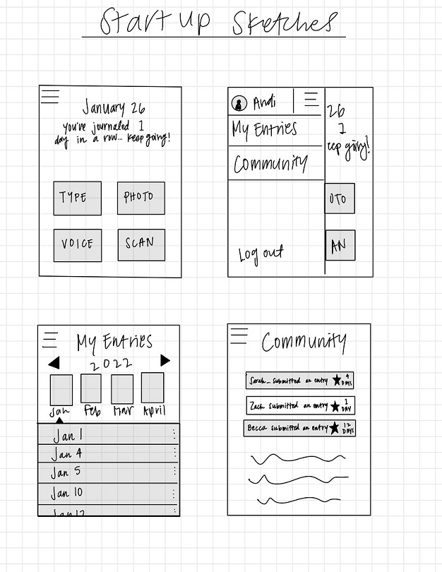

# Startup 260
My totally cool and awesome project for CS 260.

^ my change from both dev and github

Change from my dev environment.

Change from GitHub

This was a fun assignment! I've been using VS Code for one of my other classes this semester, and I love the commit feature built into it. Sometimes Linux terminals scare me, but all of these tools don't make them too bad!

# Elevator Pitch

Have you ever had the desire to keep a journal, but had difficultly actually following through because of the chore of writing? Or maybe because you just don't have the time? I've felt that way too, and that is what led me to want to create a virtual all-in-one journal. This journal allows you to document your life in whatever way you want, and to have it all in one place. Whether you're short on time and want to voice-record yourself telling a story, or simply attach photos when words fail. It will even notify others on the app when you have submitted an entry to keep yourself accountable and to inspire others to record their lives as well. Keeping a journal shouldn't be hard-- and now, it doesn't have to be!

# Key Features 
1. Text Editor
2. Image uploading
3. Audio recording 
4. Entries sorted by day
5. Notification system when an entry is submitted

# Sketches

# Site Info
http://3.14.39.141

http://andijem.click

# Notes

2/8/2023: Today I had such a struggle getting my Simon to commit and to deploy its files to my subdomain. Thankfully, I thought to start my simon-creating over and was able to reimplement the files in the correct way. The thing that I learned, which sounds silly when I state it like it is news, is that you cannot commit to a repository if you did not clone it in the first place. Even if you have a folder in your IDE, it will not push to that github repository unless that folder got there from cloning. 

3/22/2023: I did the Simon Service today! Some of it was not intuitive at all but I think I understand for the most part what is going on. 
*api calls that are handled in the index.js can be called from .js files in public. 
*classes can be added to objects through "__.classList.add('___'); "
*fetch returns a promise that returns data about the fetch call
*JSON.stringify(___) turns a json object into a string to be set in localStorage. 
*when services fail, always keep the localStorage methods implemented.